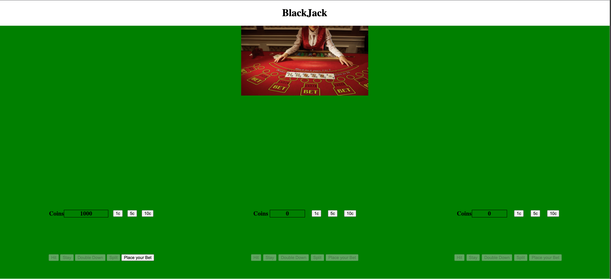
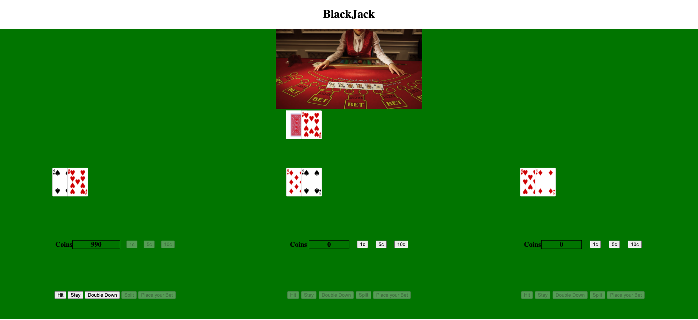

# Black Jeck Game

### Beginning of the game

### Cards on the table

# The Game

  In Blackjack, the player is playing against the dealer. The player is trying to hit 21 without going over or to get a higher number than the dealer to win. The player can also win if the dealer goes ‘bust’ or over 21. The dealer has to stay on 17 or higher.
  
  The value of each hand is the total number of the value of the cards. The card values are the number of the card, unless it is a - J, Q, K which each equal 10 - or an - A which equals either 1 or 11. The player can play the A as a 1 or 11 unless the total of all the cards is over 21, in which case the value of the A is 1.

### Placing your bet
  Select how many coins, 1 - 5 - 10, that you will bet, then select the Place your Bet button. The bet will be taken from your coins.

### Deal and play
  The dealer deals the player two cards face up and deals themself one face down and one face up. The player can select:

- Hit - get another card

- Stay - stay and it is the dealers turn

- Double down - double your bet and receive one additional card

- Split - if you have two of the same card, you can split them and play them as two hands, with the option to double down on each

### Betting in Play
  The Player can choose to Double Down at the beginning of their hand when they have two cards or after they split. The player doubles their bet and receives one additional card, then has to stay.

### Tying and Winning
  If the Player and the Dealer get the same number for their hand, there is a tie and the Player does not win or lose coins.

  The Player wins 1x their bet if they get a higher number than the dealer but do not go over 21 or if the dealer busts. For example if the Player bets 10c and wins the hand, they will have 20 coins added to your account. 

  The Player wins 1.5x their bet if they get an Ace and a 10, J, Q or K, a Blackjack, unless the dealer also gets a Blackjack, in which case it is a tie. For example if you bet 10c and you win the hand, you will have 25 coins added to your account. 

  The Player wins 2x their bet if they double down and they get a higher number than the dealer but do not go over 21 or if the dealer busts. For example if you bet 10c and you win the hand, you will have 30 coins added to your account.

### Next Game
  To proceed to the next game, click X in either the The Dealer Wins or The Player Wins box

# Technologies
- HTML

- CSS

- JavaScript

# Unsolved Problems
- Home Page
- Player's name
- Split button
- Multi Players
- Save avatar so you can play again later